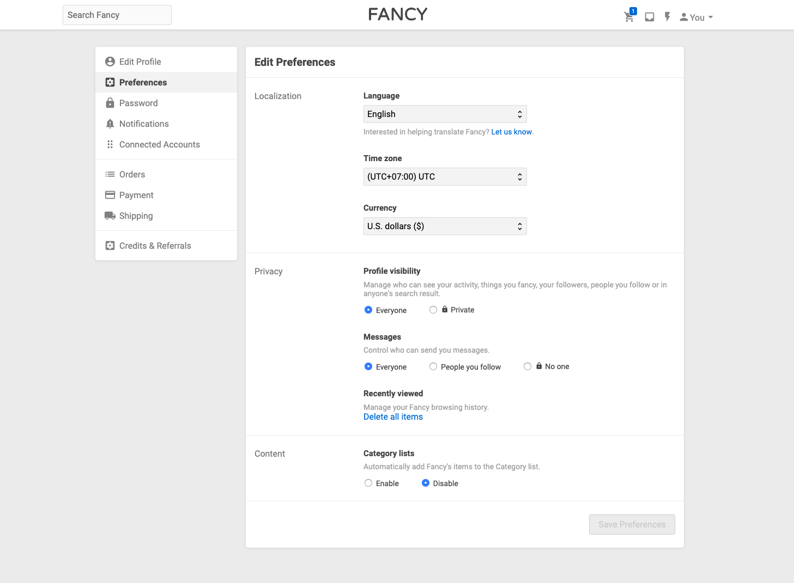

<h1 align="center">Welcome to Taskworld Assignment 👋</h1>
<p>
  
</p>



## Features

- Login / Register
- Simple user persistence using `JWT` and `localStorage`
- Redirects to `/login` when not logged-in
- Setting preferences
  - Enable `Save Preferences` button when preferences changed

## Technology

- Frontend
  - `mobx` for state management
  - `parcel` for app bundling
  - `react-router-dom` for routing
  - `styled-components` for styling
  - `axios` for http requests
  - Google fonts
  - Material Design Icons
- Backend
  - `babel` for transpiling ES6/7
  - `express` for http server
  - `mongoose` for database management
  - `bcryptjs` for password hashing
  - `passport` for authentication
  - `mocha`, `chai`, `chai-http` for testing
- Database
  - `mongodb` for database
  - `docker-compose` for running `mongodb`

## Install

```sh
yarn
```

## Runing Frontend

```sh
yarn frontend
```

## Runing Database

```sh
docker-compose up
```

## Runing Backend

```sh
yarn backend
```

## Running Tests

```sh
yarn test
```

## Author

👤 **Kongpon Charanwattanakit &lt;jackykongpon@gmail.com&gt;**
